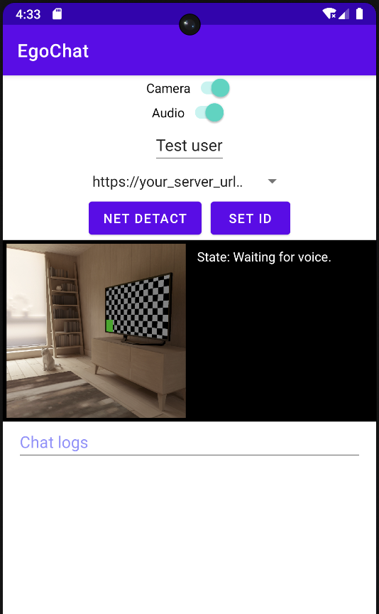

# OS-1 Client
This is the implementation of the OS-1 Client side. As we developed the app for the Android platform, it can run on any device using the Android operating system, such as Android smartphones.
## Platform
- ≥ Android 12

## How to use
1. Configure `server_ips` in `res/values/array.xml` and `server_url` in `MainActivity.kt`. They were initially set to "https://your_server_url.com", please modify them to the URL of the actual OS-1 server deployment.
2. Configure `aliAppKey` in `AudioRecordingService.kt`. We use the [Ali ASR API](https://ai.aliyun.com/nls) to implement the functionality of interrupting dialogue. When the hot word 'OK' is recognized, OS-1 will automatically stop speaking. Additionally, we have implemented hot word detection based on [CMU Sphinx](https://cmusphinx.github.io/) in MainActivity.kt, which can serve as an alternative to the Ali ASR API.
3. Build the app using Android Studio. When run successfully, the app's interface looks as shown in the following image.

 

