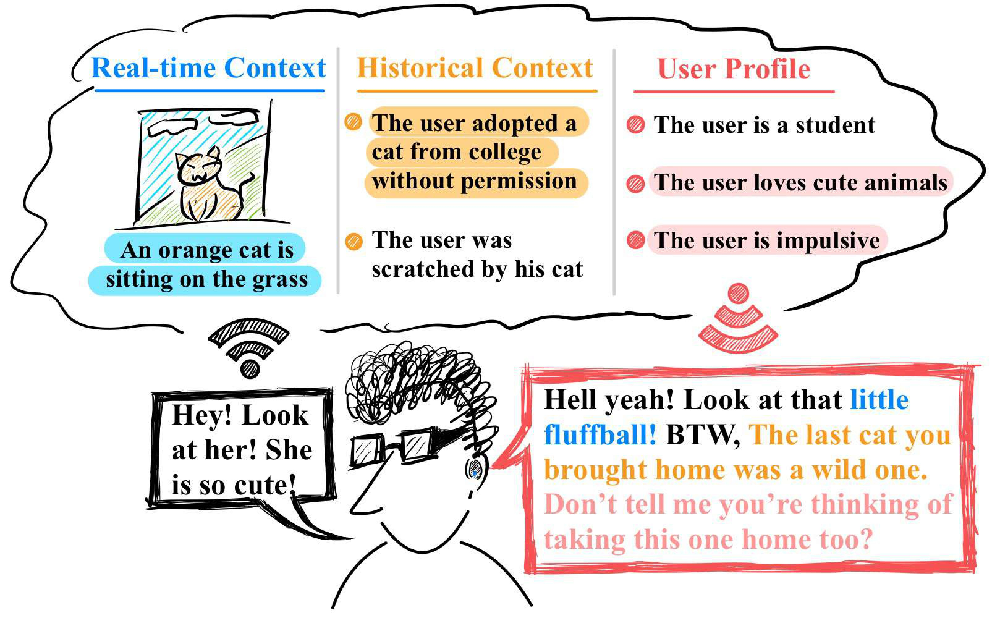
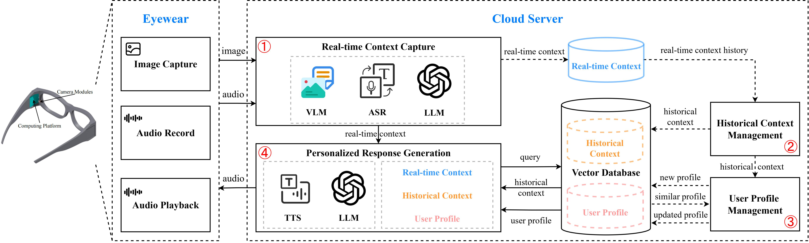

# OS-1
**OS-1 System Implementation for IMWUT 2024 Paper 'Can Large Language Models Be Good Companions? An LLM-Based Eyewear System with Conversational Common Ground'**

<div  align="center"> 

</div>

ArXiv Preprint Link: https://arxiv.org/abs/2311.18251

## Introduction
We propose the construction of **a common-ground-aware dialogue system, named OS-1**, utilizing an LLM-based module to enable chatbot companionship. 




Hosted by eyewear, OS-1 can perceive the visual and audio signals received by the user, extracting real-time contextual semantics. These semantics are categorized and recorded to establish historical contexts from which the user's profile is distilled and evolves over time, allowing OS-1 to gradually learn about its user. OS-1 integrates knowledge from real-time semantics, historical contexts, and user-specific profiles to generate a common-ground-aware prompt input into the LLM module. The output of the LLM is converted to audio and spoken to the wearer when appropriate.


## Usage
The implementation of OS-1 adopts a hybrid architecture combining cloud and edge computing:

* The **edge component** is responsible for collecting visual and audio signals, uploading this data to cloud servers, and receiving feedback in the form of speech for dialogue responses. Developed on the Android platform, the configuration and deployment details are available in the [OS-1 Client](https://github.com/MemX-Research/OS-1/tree/main/OS-1%20Client) directory.
* The **cloud component** handles visual and audio signal processing and utilizes large language models to drive multimodal understanding during dialogue, policy planning, memory generation, and retrieval, as well as dialogue generation. Configuration and deployment details for the edge component are available in the [OS-1 Server](https://github.com/MemX-Research/OS-1/tree/main/OS-1%20Server) directory.

## Demo
The following video demonstrates a usage scenario of interacting with the OS-1 prototype. For detailed smart eyewear hardware specifications, please refer to the paper.

https://github.com/MemX-Research/OS-1/assets/46283941/c9ed2806-7764-4421-85d5-6f1ce15f4f38


## Citation
If you find OS-1 useful for your research and applications, please cite it using the following BibTeX:
```bibtex
@article{xu2023can,
  title={Can Large Language Models Be Good Companions? An LLM-Based Eyewear System with Conversational Common Ground},
  author={Xu, Zhenyu and Xu, Hailin and Lu, Zhouyang and Zhao, Yingying and Zhu, Rui and Wang, Yujiang and Dong, Mingzhi and Chang, Yuhu and Lv, Qin and Dick, Robert P and others},
  journal={arXiv preprint arXiv:2311.18251},
  year={2023}
}
```
